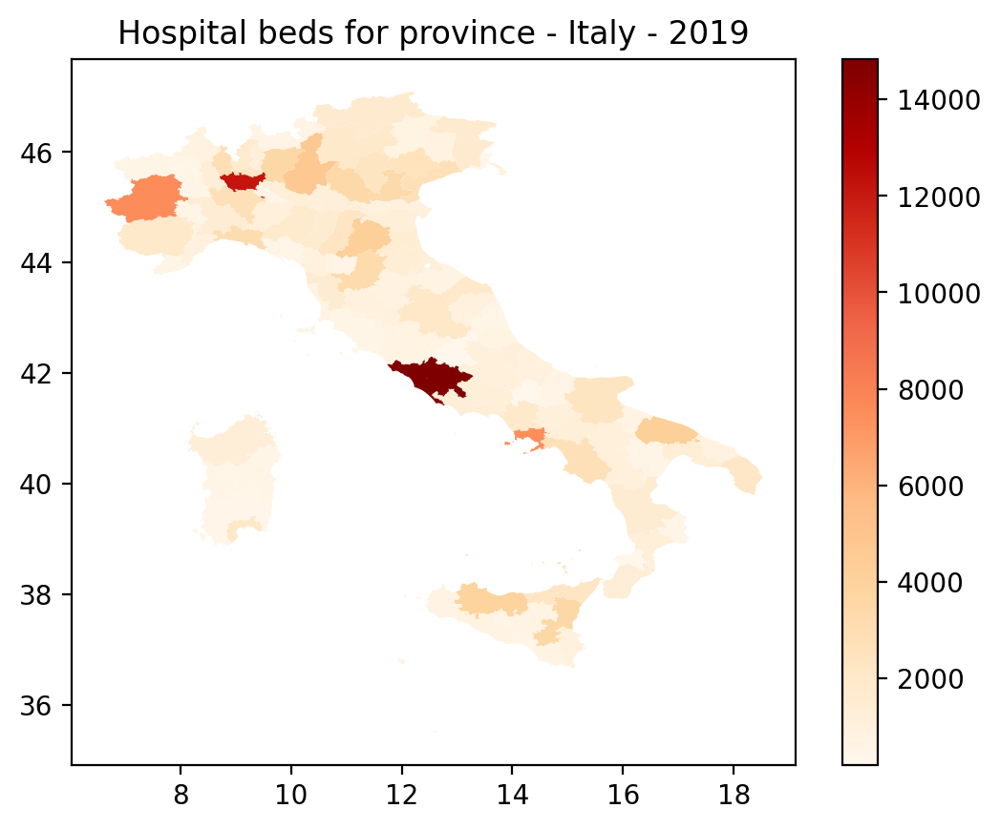
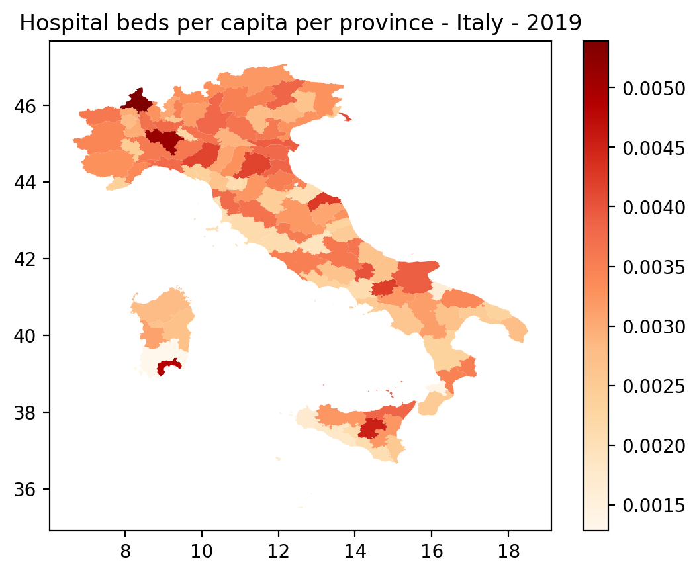
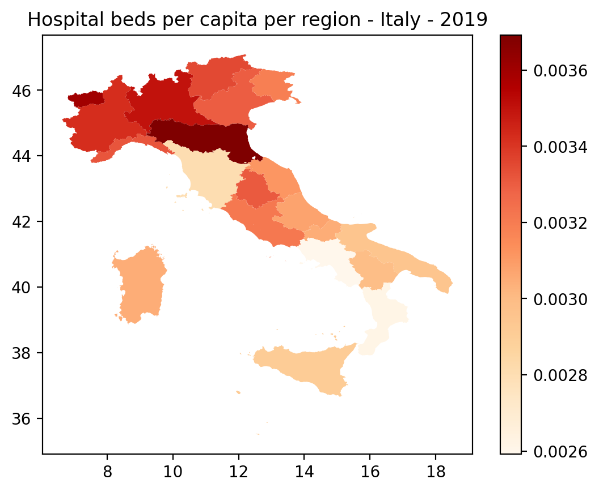

👨‍🏫 Guide
=====================

.. important::
    Italy-geopop was thought to be primarily used as a `pandas.Series <https://pandas.pydata.org/docs/reference/api/pandas.Series.html>`_ `accessor <https://pandas.pydata.org/docs/development/extending.html>`_.
    While some of its functions can be used and are useful outside pandas integration, the guide will focus on ``italy_geopop`` pandas accessor.

Tutorial #1 - Hospital beds in Italy
---------------------------------------

  **How many hospital beds are there in Italy?**

""""""""""""""""""""""""""""""""""""""""""""""""""""

Let's suppose you want to answer this question. Then you will need hospital beds data. Luckily the Italian Health Ministry published such data under `Italian Open Data License <https://www.dati.gov.it/iodl/2.0/>`_, so everyone can access data `here <https://www.dati.salute.gov.it/dati/dettaglioDataset.jsp?menu=dati&idPag=18>`_.

.. note::
  A simplified version of that dataset with only the useful columns translated in english and filtered for ``year==2019``, the latest available, is available for download and will be used in this guide.
  
  👉 `open_data_italy_hospitals_beds_2019.csv <_static/assets/open_data_italy_hospitals_beds_2019.csv>`_

Let's read the csv file and see how it looks like.

.. code-block:: python
  :linenos:
  
  import pandas as pd
  df = pd.read_csv('open_data_italy_hospitals_beds_2019.csv', dtype={'beds':float, 'province_short':str}, keep_default_na=False)
  df.head(10)

.. csv-table::
  :file: _static/assets/tut_01_table_00.csv
  :header-rows: 1

.. warning::

  Remember to use ``keep_default_na=False`` when reading dataset as ``province_short``, which is the province short name,
  for Naples is *'NA'*, so pandas default behaviour is to treat it as null.

The dataset contains only two columns: ``beds`` and ``province_short``. As you can notice province_short has values repeated multiple times,
that's because every row of the table is an hospital in the original dataset, so we need to group the dataset by ``province_short`` and sum the ``bed`` column.
In that way we will obtain a dataset with the number of hospital beds for every province.

.. code-block:: python
  :lineno-start: 4

  df = df.groupby(['province_short'], as_index=False).sum()
  df.head()

.. csv-table::
  :file: _static/assets/tut_01_table_01.csv
  :header-rows: 1

At this point we may want to plot the geospatial distribution of hospital beds and that's when **italy-geopop** can helps us.

First of all, let's **activate the accessor**. This registers the accessor to pandas and let us take advantage of italy-geopop functionalities.

.. code-block:: python
  :lineno-start: 6

  from italy_geopop.pandas_extension import pandas_activate
  pandas_activate(include_geometry=True)

.. hint::

  You may want the accessor to only live in a specific context. You can do so using ``pandas_activate_context`` that has the same syntax of pandas_activate.
  This is useful if you want to register the accessor with different initialization options more than once in your code or if you want to free up memory right
  after you get the needed data (the trade off is that italy-geopop needs to be reinitialized everytime you register and use the accessor).

  Here you can find the :ref:`complete api reference documentation <pandas_extension>` for both ``pandas_activate`` and ``pandas_activate_context``.

And now we can get the geospatial data we need to plot the geospatial distribution using ``italy_geopop.from_province`` accessor.

.. code-block:: python
  :lineno-start: 8

  df[['geometry']] = df.province_short.italy_geopop.from_province(return_cols=['geometry'])
  print('df type:', type(df))
  df.head()

This should output

.. code-block::
  
  df type: <class 'pandas.core.frame.DataFrame'>

.. csv-table::
  :file: _static/assets/tut_01_table_02.csv
  :header-rows: 1

Now we have geospatial data for every province but ``df`` is a ``pandas.DataFrame`` instance and we need a ``geopandas.GeoDataFrame`` instance in order to generate the plot.

.. note::

  Note that we created the ``geometry`` column with double square brackets, that's because italy_geopop accessor 
  actually return a subset of another dataframe, so passing ``return_cols=['geometry']`` will make the accessor
  return a 2-dimensional ``pandas.DataFrame`` and passing ``return_cols='geometry'`` will make the accessor return
  a 1-dimensional ``pandas.Series`` instance.

.. code-block:: python
  :lineno-start: 11

  import geopandas as gpd
  import matplotlib.pyplot as plt

  df = gpd.GeoDataFrame(df)
  
  df.plot(
      'beds',
      cmap='OrRd',
      legend=True
  )
  plt.title('Hospital beds for province - Italy - 2019')
  plt.tight_layout()

We can see that there are a few provinces with a very high number of hospital beds and the others seem to have a very low number of beds.

There must be some kind of *bias*.

At least we need to adjust the number of beds for province's population and italy-geopop can help us even in this task.

.. code-block:: python
  :lineno-start: 23
  
  df['population'] = df.province_short.italy_geopop.from_province(return_cols='population')
  df['beds_per_capita'] = df.beds / df.population
  df.head()

.. csv-table::
  :file: _static/assets/tut_01_table_03.csv
  :header-rows: 1

Here we created the ``population`` column. *Note that we assigned it using single square brackets because the output
of italy_geopop accessor was 1-dimensional.* Then we created ``beds_per_capita`` column dividing beds for population
which produces the number of hospital beds for person.

Now we can create the same plot as before but adjusted for province population.

.. code-block:: python
  :lineno-start: 26

  df.plot(
      'beds_per_capita', 
      cmap='OrRd',
      legend=True
  )
  plt.title('Hospital beds per capita per province - Italy - 2019')
  plt.tight_layout()

This representation is surely more accurate than the previous one, but distribution seems to have an elevated variability despite the adjustment we made.

Healthcare in Italy is largely adminsitrated at a regional level, so maybe it would be more accurate to plot the distribution of hospital beds by region instead.
Let's do so.

Firstly, we reload our dataset and get the region_code using ``italy_geopop.from_province`` accessor.

.. code-block:: python
  :lineno-start: 33

  df = pd.read_csv('./docs/source/_static/assets/open_data_italy_hospitals_beds_2019.csv', dtype={'beds':float, 'province_short':str}, keep_default_na=False)
  df['region_code'] = df.province_short.italy_geopop.from_province(return_cols='region_code')
  df.head()

The expected output is

.. csv-table::
  :file: _static/assets/tut_01_table_04.csv
  :header-rows: 1

Then we use ``pandas.DataFrame.groupby`` to group the dataset by ``region_code`` and sum the beds.

.. code-block:: python
  :lineno-start: 36

  df = df.groupby(['region_code'], as_index=False)[['beds']].sum()
  df.head()

.. csv-table::
  :file: _static/assets/tut_01_table_05.csv
  :header-rows: 1

Then we can get geospatial and population data for regions using ``italy_geopop.from_region`` accessor.
Then we recalculate the ``beds_per_capita`` column dividing number of region's hospital beds for region's population.

.. code-block:: python
  :lineno-start: 38

  df[['geometry', 'population']] = df.region_code.italy_geopop.from_region(return_cols=['geometry', 'population'])
  df['beds_per_capita'] = df.beds / df.population
  df = gpd.GeoDataFrame(df)

.. note::

  At this point you may have noticed that we have used ``region_code`` to feed ``italy_geopop.from_region``. That is possible
  because the accessor will recognize the kind of data you pass to it, wheater it is region full name or region code,
  *e.g. 'Piemonte' == 1*. This behaviour is valid also for ``italy_geopop.from_municipality``, that can accept municipality name
  or municipality code, *e.g. 'Torino' == 1272*, and is valid also for ``italy_geopop.from_province``, that can accept not only province name and province_code
  but also province short name, that's actually what is used in this tutorial, *e.g. 'TO' == 'Torino' == 1*.
  Moreover you can pass mixed data type to the accessor.

.. code-block:: python
  :lineno-start: 41

  df.plot(
      'beds_per_capita', 
      cmap='OrRd',
      legend=True
  )
  plt.title('Hospital beds per capita per region - Italy - 2019')
  plt.tight_layout()

This plot shows some differences across regions in the number of hospital bed per person, but the variability is smaller.
Also every region has its own health policy so the number of hospital beds can be lower while still providing an adeguate
healthcare quality.

